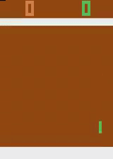
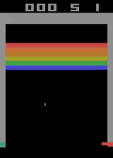
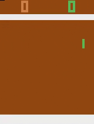
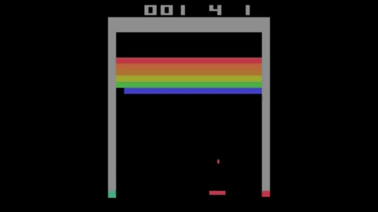

**Important Note: the codes for Acme and Stable Baselines3 are adapted from the original repositories (https://github.com/deepmind/acme) and (https://github.com/DLR-RM/stable-baselines3) respectively.**

# CS523 Team6: Deep Reinforcement Learning on Atari Game Environments 
---
## Team Members
1. Hayato Nakamura (nhayato@bu.edu)
2. Ngozi Omatu (nomatu@bu.edu) 

## Overview
Most of the classical RL algorithms heavily rely on the hand-crafted features and linear value/policy functions. In other words, the quality of the feature representation have a huge impacts on the performance of such RL algorithms. Deep Reinforcement Learning allows for agent to make decisions (Trial and Error) without manual engineering on the  state  feature information. Therefore, Deep RL can surpass human performance with end-to-end training, and very ideal for dynamic environments.

Our goal of this project is to reproduce the results (average rewards per episodes) of the Deep Q-learning model ("Playing Atari with Deep Reinforcement Learning") on Atari games by Deepmind using two deep reinforcement learning libraries: (1) DM-Acme and (2) Stable-Baselines3. We focused on two specific Atari games: Pong and Breakout.

## Demo
#### Pong (DM-Acme Version; 10,000 episodes)

#### Breakout (DM-Acme Version; 15,000 episodes)


#### Pong (Stable Baselines3 Version; 500,000 timesteps)

#### Breakout (Stable Baseline3 Version: 11,000,000 timesteps) 

## Presentation Slide
[Link to out Presentation Slide](https://docs.google.com/presentation/d/1l92XqlJAMLf_295_ee_JGwacpbwI9a2rp6fkjUJEXXg/edit?usp=sharing)
**Note**: To access the presentation document, you need to login to Google Account using Boston University Credential.

## How to Run the Code
#### DM-Acme
1. ```$ git clone https://github.com/raltech/CS523_Project.git```
2. ```$ cd ./CS523_Project```
3. ```$ pip install -r ./Acme/acme_requirements.txt```

To train the DQN agent on Pong environment:
1. Open ```./Acme/dm_acme_pong.ipynb```
2. Executes cells from the top.

To train the DQN agent on Breakout environment:
1. Open ```./Acme/dm_acme_breakout.ipynb```
2. Executes cells from the top.

Checkpoints for the trained agents:
1. The checkpoints for the trained Pong agent (10,000 episodes) can be downloaded from here: (https://drive.google.com/file/d/1KeaD8ZdHCbv3-qOr7rK4_8hpXY8anNXR/view?usp=sharing). 
2. The checkpoints for the trained Breakout agent (55,000 episodes) can be downloaded from here: (https://drive.google.com/file/d/1z25WiW0TUCtjTLu35C-hKdJNAiXxSzqS/view?usp=sharing).
*You need to login with Boston University Credential to access these files.*

#### Stable-Baselines3
1. ```$ git clone https://github.com/raltech/CS523_project.git```
2. ```$ cd ./CS523_project```

To train the DQN agent on Pong enviroment: 
1. Open ```./Stable_baselines/Pong_rl_baselines_zoo.ipynb```
2. Execute cells from the top.
Note: To run the trained model, the zip file for PongNoFramework should be added to the logs/dnq folder. This file is created after copying the gitfor Stable baseline3 zoo.

The file of the pretrained model for pong is avaliable in the same branch as the code. 
To train the DQN agent on Breakout enviroment: 
1. Open ```./Stable_baselines/Breakout_rl_baselines_zoo.ipynb```
2. Execute cells from the top.


## Results
|                                   |  Pong  | Breakout         |
| -----------                       |:-----: | :------:         |
| Random                            | -20.4  |  1.2             |
| Sarsa                             | -19    |   5.2            |
| Contingency                       | -17    | 6                |
| Human                             | -3     | 31               |  
| DQN (Original)                    | 20     | **168**          |
| **DQN (Ours; DM-Acme)**           | **21** | In Progress (101) |
| **DQN (Ours; Stable-Baselines3)** | 20.4   | In Progress (0)  |
   
- Numbers represent the scores obtained in each game by each agent.
- The results for the first five rows (Random, Sarsa, Contingency, Human, and DQN (Original)) are obtained from the original paper (Playing Atari with Deep Reinforcement Learning).
- Our models (both DM-Acme and Stable-Baselines3) surpassesd the original DQN result reported in the paper. 
- Breakout takes a significantly more time to train than Pong. Although we have not achived the original score (168), we see a steady increase in our agents' performance. With more training time, we are sure that we can get a similar or better result on Breakout as well.


## References
**Playing Atari with Deep Reinforcement Learning (https://arxiv.org/abs/1312.5602)**
Mnih, Volodymyr & Kavukcuoglu, Koray & Silver, David & Graves, Alex & Antonoglou, Ioannis & Wierstra, Daan & Riedmiller, Martin. (2013). Playing Atari with Deep Reinforcement Learning. 

**Pong image used in our presentation slide**
https://minpy.readthedocs.io/en/latest/tutorial/rl_policy_gradient_tutorial/rl_policy_gradient.html

**Breakout image used in our presentation slide**
https://noteoneverything.blogspot.com/2018/02/reinforcement-learning-of-atari-breakout.html

**DQN Architecture image used in our presentation slide**
https://leonardoaraujosantos.gitbook.io/artificial-inteligence/artificial_intelligence/reinforcement_learning/deep_q_learning
